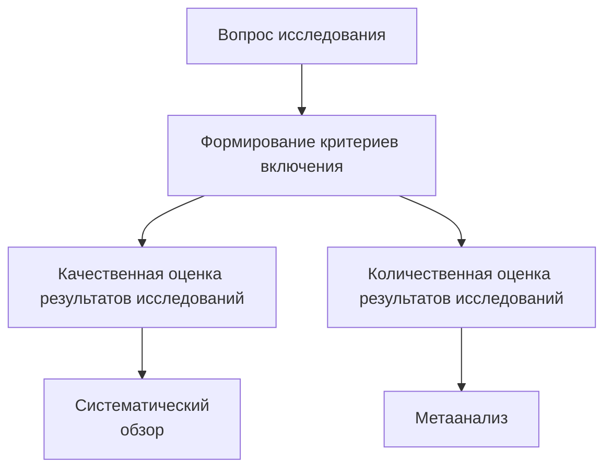
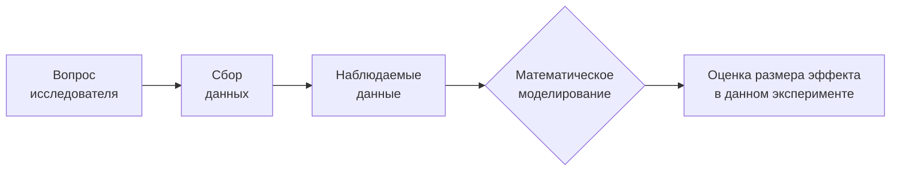

# Метаанализы и метарегрессии

https://www.ncbi.nlm.nih.gov/pmc/articles/PMC3083073/

https://www.google.com/search?q=Designing+clinical+research&sxsrf=AOaemvKJpgFS_eG6kQKAEmPQvMIDkh_7vA:1643268646973&ei=JkryYYnVOqOrrgSF3r-YCQ&start=0&sa=N&ved=2ahUKEwiJgOTftNH1AhWjlYsKHQXvD5M4ChDy0wN6BAgBED4&biw=1920&bih=936&dpr=1

https://www.google.com/search?q=Cummings%2C+Steven+R%2C+Warren+S+Browner%2C+and+Stephen+B+Hulley.+2013.+%E2%80%9CConceiving+the+Research+Question+and+Developing+the+Study+Plan.%E2%80%9D+Designing+Clinical+Research+4%3A+14%E2%80%9322.&sourceid=chrome&ie=UTF-8

## Что такое метаанализ и для чего он нужен?

Число научных публикаций растет в геометричекой прогрессии ежегодно. Исследователи со всех уголков земного шара пытаются проверить свои гипотезы. Несколько хорошо спланированных исследований принесут больше пользы в пллане понимания проверяенмых гипотез, чем одно большое и неважно спланированное, лишь для того, чтобы включить много пациентов. Проверяя гипотезы в разных популяциях мы получаем бесценные данные о том, что а) эффект прослеживается у разных групп (или, наоборот, есть только в конкретных группах) б) получаем информацию о вариабельности эффекта. Большое количество сходных исследований, по сути, являются репликациями одного большого эксперимента. Соответствено, большее количество репликаций повышает мощность и степень доверия к результатам.

Существуют несколько основных инструментов суждения о совокупных результатах неких единообразных исследований:

- **Систематические обзоры**. Систематические обзоры включают все исследования, которые возможно найти, соответствующие неким строгим критериям включения. Данные критерии включения направлены на соблюдение ряда стандартов, предъявляемых к планированию исследований, проведению и стандартным операционным процедурам и результатам (например, исследования по артериальной гипертензии, где артериальное давление оценивалось в соответствии с международными рекомендациями по кардиологии; исследования определенной манипуляции в хирургии, которая выполнялась строго в соответствии с четкими рекомендациями международных ассоциаций). 

- **Метаанализы**. Главным отличием метаанализа от систематических обзоров является не только рассмотрение результатов ряда исследований, но и попытка количественной оценки их результатов. В самом деле, нам необходимо знать не только то, что препарат/вмешательство обладает эффектом, но и оценить размер этого эффекта, и широту его вариабельности.

## Основной вопрос исследователя

Как мы с вами [уже говорили](/docs/pages/stat_testing/stat_testing.md), любое исследование/эксперимент начинается с постановки вопроса. Метаанализ позволяет ответить на вопросы, на которые уже пытались ответить в проведенных исследованиях. Чем точнее и конкретнее исследователи ставят вопрос, тем яснее становится, можно ли на него ответить с помощью метаанализа и какие исследования подходят для этого.  

Например, мы можем поставить вопрос о том, существует ли возрастные смещения среди пациентов, перенесших острый ишемический инсульт в старческом возрасте. Для начала , определим, что такое старческий возраст.  Мы провели литпоиск и поняли, что *старческий возраст* - это возраст 75 лет и старше (например). Далее нам нужжно определить генеральную совокупность. Целесообразно привязать наш вопрос к некоей георграфической области, например, Владимирская область. Либо сузить критерии по-другому, например, брать исследования только в крупных мегаполисах России (или , наоборот, в малых городах). Всё зависит от того, что на самом деле мы хотим исследовать. 

Как только нам стало несколько яснее с вопросом исследования, мы начинаем вырабатывать **критерии включения**. Существуют т.н. критерии PICO [^Mattos] (Population, Intervention, Control group/comparison, Outcome), позволяющие сформулировать критерии включения:

- Популяция. Какие пациенты подойдут для ответов на наши вопросы, а какие - нет? Начать можно с банальной демографии (пол, возрастные группы и т.д.), заканчивая вопросами анамнеза (пациенты с установленным кардиостимулятором по поводу синдрома тахи-бради в течение последних 6 месяцев и т.д.). Могут ли быть использованы данные пациентов, коорые самостоятельно заполнили опросники исслдования, либо нужно включать только исследования, где всю документацию заполнил лечащий врач? Или это долженбыть врач-исследователь (ведь лечащий врач может направить более тяжелого пациента в исследование, т.к. хочет дать ему шанс, что приведет к потенциальному *selection bias*)? 

- Вмешательство. Какое вмешательство будет выполнено (терапевтическое, хирургическое, без вмешательства и т.д.)? Если это хирургическое вмешательство/манипуляция, по каким стандартам оно должно быть выполнено? как оценивался эффект вмешательства (оценка уровня гемоглобина на фоне резекции селезенки, осложненном кровотечением: в одних исследованиях анализ крови брали сразу после завершения операции, в других - на первые сутки)? Сопоставимо ли было оборудование при проведении вмешательства (например, оценка некоторых УЗ-параметров может сильно отличаться у разных производителей, у одного производителя на аппарате экспетрного класса и портативном аппарате)?

- Контрольная группа и группа сравнения. Принципиально ли наличие контрольной группы? Будет ли в этой группе проведена терапия *плацебо*, либо это будет *активный компаратор*? Как в исследовании учитывался прием/неприме препарата? Какой принцип анализа проводился - Intention-To-Treat, Per Protocol или As Treated?

- Конечная точка. Какая конечная точка использована в исследованиях (мягкая, жесткая, комбинированная и т.д.)? Одинаковы ли конечные точки по всем исследованиям, , если нет, принципально ли рассмотерть их, как единую? Как оценивался размер эффекта по разным исследованиям? Возможно ли рассчитать стандартизованный размер эффекта для разных исследований? Когда оценивалась конечная точка (в онкологических исследованиях отдаленная летальность может быть оценена на сроке 3,5 7 и 10 лет - это принципиально разные конечные точки). 

Также важным аспектом является выбор типа исследований для включения в метаанализ. Безусловно, самым высоким стандартом являются рандомизированные клинические исследования (РКИ) с прозрачным и качественным протоколом. Однако, есть ситуации, когда РКИ еще не проведены или не будут проведены по этическим причинам. В таких ситуациях целесообразно рассмотретьпилотные или качественные обсервационные исследования. Меньшей доказательной ценностью обладает, как считается, так называемая *серая литература (grey literature)*: коммерческие отчеты о клинических исследованиях, препринты, тезисы конференций, а также диссертационные работы [^Schöpfel]. 

## Избранные рекомендации

Существует большое количество рекомендаций о том, как писать метаанализ, проводить поиск, предоставлять данные. Ниже приведены ссылки на некоторые из них:

- Cochrane Handbook for Systematic Reviews of Interventions [^Cochrane];

- Preferred Reporting Items for Systematic Reviews and Meta-Analyses (PRISMA) [^PRISMA];

- American Psychological Association’s Meta-Analysis Reporting Standards (MARS) [^MARS];

Если вы планируете проделать метаанализ, данные рекомендации - минимум, от корого нужно оттолкнуться. Настоящий же обзор сфокусирован на прикладных техниках проведения метаанализа. 

## Протокол метаанализа

Весь ход нашей работы логично документировать в протоколе, содержащим традиционные разделы о цели, задачах, критериях включения/невключения, диаграммы дазайна (общепринятые диаграммы имеются на сайте [PRISMA](http://prisma-statement.org/PRISMAStatement/FlowDiagram)), описание материалов и методов, результатов и выводов. 

**Типичная диаграмма дизайна метаанализа**

---

# Размеры эффекта

## Что такое размер эффекта?

Мы уже касались понятия размера эффекта [в статье о тестировании статистичеких гипотез](/docs/pages/stat_testing/stat_testing.md).

Напомню, что размер эффекта обозначает некую статистику или показатель, показывающий величину различий или ассоциации между распределениями. Наличие эффект и его размер - то, что мы пытаемся оценить для того, чтобы сделать статистический вывод о том, возможно ли отвергнуть нулевую гипотезу. 

В силу того, что методы проведения разных исследований отличаются по тем или иным причинам (например, есть различия между базовыми характеристиками пациентов или по оценке конечной точки с помощью разных шкал или единиц измерения и т.д.), возникает вопрос о приведении результатов исследований к некоему единому виду. часто это возможно сделать с помощью оценки размеров эффекта. В некоторых исследованиях размер эффекта приводится напрямую, в других же его приходится вычислять. 

При выборе подходящей оценки размера эффекта необходимо помнить, что требуемая метрика должна соответствовать нескольким практическим критериям:

- размер эффекта банально *возможно* оценить по результатам всех включенных исследований;

- размер эффекта должна *одинаково рассчитываться* по результатам всех исследований;

- размер эффекта подчиняется некоему теоретическому распределению, что позволяет рассчитать стандартную ошибку и взвешенный эффект;

- определение размера эффекта должно позволить ответить на вопрос исследования, т.е., размер эффекта должен быть *интерпретируемым*;

Размер эффекта имеет *выраженность и направление*. Выраженность и характеризует тот самый *размер*, а направление показывает куда изменение направлено. Например, коэффициент корреляции по Пирсону $r = -0.8$ означает сильную ассоциацию между переменными (выраженность), но при этом такая ассоциация обратная - чем выше одна величина, тем ниже другая (направление эффекта). 

*Истинный размер эффекта* исследования k $\theta_k$ складывается из *наблюдаемого в исследовании размера эффекта* $\hat{\theta_k}$ в исследовании и ошибки выборки $\epsilon_k$:

$$
\theta_k = \hat{\theta_k} + \epsilon_k
$$

Соответственно, мы  считаем, что среди нескольких исследований наиболее точными являются те, где $\epsilon$ наименьшая. таким исследованиям в метаанализе придается больший *вес*. Оценка $\epsilon$ производится с помощью *стандартной ошибки*, которая представляет собой стандартное отклонение выборочного распределения. Выборочное распределение является вероятностным распределением некоей статистики, когда мы выбираем случайные выборки одинакового размера $n$ из генеральной совокупности большое количество раз. 

Приведем пример. Существует генеральная совокупность с неким показателем $x$, имеющим нормальное распределение со средним значением в генеральной совокупности (истинная средняя) $M$ и стандартным отклонением в генеральной совокупности (истинное стандартное отклонение) $\sigma$.
Если мы возьмем из генеральной совокупности выборку длиной $n$, среднее значение выборки $\mu_k$ будет отличаться от $M$ на величину некоей ошибки. Если мы снова возьмем выборку длиной $n$, среднее новой выборки $\mu_{k+1}$ также будет отличаться от $M$, но ошибка будет несколько другой. 

Стандартная ошибка (*SE*) отражает отклонение точечной оценки (например, среднего значения) в выборке от истинного значения параметра в генеральной совокупности. Стандартная ошибка вычисляется по формуле

$$
SE = \frac{\sigma}{\sqrt{n}},
$$

где $\sigma$ - истинное стандартное отклонение в генеральной совокупности, $n$ - длина выборки. Соответственно, чем больше размер выборки $n$, тем меньше отклонение от среднего в генеральной совокупности, и тем меньше стандартная ошибка.

Рассмотрим пример на основании генеральной совокупности, где средняя равна 0, а стандартное отклонение 3. Создадим 500 случайных выборок длиной от 1 до 500 и рассчитаем для каждой выборочное среднее и стандартную ошибку. Результат представлен на графиках ниже. 

**Среднее значение выборки в зависимости от ее размера (средняя генеральной совокупности равна 0)**

**Стандартная ошибка в зависимости от размера выборки для верхнего графика**

Таким образом, мы видим, что с увеличением объема выборки $n$ выборочное среднее $\mu$ стремится к среднему генеральной совокупности $M$ (к значению 0 на графике), а стандартная ошибка $SE$ при увеличении длины выборки снижается и стремится к 0. 

### Как оценивается размер эффекта?

Огромный вклад в концепцию размера эффекта внес психолог и статистик Jacob Cohen. Сегодня существует большое количество статистик, позволяющих оценить размер эффекта, фактически при проверке любых гипотез.

Выделяют стандартизованные методы оценки размера эффекта и нестандартизованные. Стандартизованные способы позволяют оценивать эффект для переменных с разной размерностью (например, оценка коэффициента корреляции для переменных, измеряемых в разных единицах), для оценки совокупных результатов  разных исследований (мета анализ и мета регрессия), при сравнении результатов исследований с использованием разных метрик переменных (например, при использовании г/л в одном исследовании и ммоль/л в другом). 

Рассмотрим основные способы оценки размера эффекта и вычисления стандартной ошибки для вещественных признаков и признаков, представленных бинарными переменными. 

#### Вещественные признаки

**Таблица 1. Избранные методы оценки размера эффекта, оценивающие вещественные признаки**

| Название                                               | Описание                                                     | Стандартизованный метод | Размер эффекта $\theta$                    | Стандартная ошибка $SE$                                      |
| ------------------------------------------------------ | ------------------------------------------------------------ | ----------------------- | ------------------------------------------ | ------------------------------------------------------------ |
| Среднее                                                | Среднее значение                                             | Нет                     | $\mu$                                      | $SE = \frac{sd}{\sqrt{n}}$                                   |
| Дельта средних                                         | Дельта между 2-мя средними                                   | Нет                     | $MD = \mu_1 - \mu_2$                       | $SE = s_{pooled}^* \times \sqrt{\frac{1}{n_1}+\frac{1}{n_2}}$ |
| Стандартизованная дельта средних                       | Разница между 2-мя средними, отнесенная ко взвешенному стандартному отклонению. | Да                      | $SMD = \frac{\mu_1 - \mu_2}{s^*_{pooled}}$ | $SE = \sqrt{\frac{n_1 + n_2}{n_1 n_2} + \frac{SMD^2}{2(n_1 + n_2)}}$ |
| Дельта средних с парными измерениями                   | Разница между 2-мя средними после вмешательства и до вмешательства | Нет                     | $MD = \mu_{t2} - \mu_{t1}$                 | $SE = \sqrt{\frac{s^2_{t2} + s^2_{t1} - 2(r_{t1t2}s_{t2}s_{t1})}{n}}$ |
| Стандартизованная дельта средних с парными измерениями | Стандартизованная разница между 2-мя средними после вмешательства и до вмешательства | Да                      | $SMD = \frac{\mu_{t2} - \mu_{t1}}{s_{t1}}$ | $SE = \sqrt{\frac{2(1-r_{t1t2})}{n} + \frac{SMD}{2n}}$       |

Для некоторых статистик используется взвешенное стандартное отклонение. Рассчитать его возможно по формуле:

$$
s_{pooled} = \sqrt{\frac{(n_1 - 1)s^2_1 + (n_2 - 1)s^2_2}{(n_1 - 1) + (n_2 - 1)}}
$$

#### Для чего нужны стандартизованные показатели?

Предположим, у нас есть 2 исследования по снижению систолического артериального давления (САД). Мы даем пациентам один и тот же препарат, однако в 1 исследовании пациенты с преимущественно мягкой гипертензией, в исследовании 2 - пациенты с тяжелой артериальной гипертензией. Более того, в исследованиях разное количество пациентов. Основные статистики для обоих иследований приведены в табл.Х.

|                | Количество пациентов | Среднее значение САД и стандартное отклонение на включении | Среднее значение САД и стандартное отклонение при завершении исследования | Дельта средних MD [95% ДИ]| Стандартизованная дельта средних с парными измерениями [95% ДИ]   |
| -------------- | -------------------- | ---------------------------------------------------------- | ------------------------------------------------------------ | -------------- | ----- |
| Исследование 1 | 56                   | 154 ± 13 мм рт. ст.                                        | 131 ± 17 мм рт. ст.                                          | - 23 [-25.1;-20.9]          | -1.77 [-1.86; -1.67] |
| Исследование 2 | 34                   | 187 ± 25 мм рт. ст.                                        | 160 ± 26 мм рт. ст.                                          | -27 [-31.4; -22.6]           | -1.08 [-1.31; -0.84]|

Мы видим, что на включении группы различаются как по средним значениям, так и по стандартным отклонениям. Из-за того, что группа в исследовании 2 меньше, стандартное отклонение там несколько больше, что логично. 

Если мы оценим банальную разницу средних (MD), мы увидим, что снижение САД в абсолютном значении чуть больше снизилось в исследовании 2. Однако, если мы посчитаем стандартизованные средние для исследований с парными измерениями, мы увидим, что в исследовании 1 стандартизованная средняя почти в 2 раза выше, чем в исследовании 2. 

Таким образом, если опираться на стандартизованные значения размера эффекта, среди пациентов исследования 1 снижение САД было более выраженным, чем среди  пациентов с тяжелой гипертензией в исследовании 2. 

Другая ситуация может быть связана с разными размерностями переменных. Например, при исследовании обезболивающего препарата в одном исследовании использовалась визуальная аналоговая шкала боли от 0 до 10, а в другом от 0 до 50. Сравнить эффект по разным шкалам нам снова поможет стандартизованный показатель:

|                | Количество пациентов | Срадний балл ВАШ на включении | Срадний балл ВАШ при завершении исследования | Дельта средних MD [95% ДИ] | Стандартизованная дельта средних с парными измерениями [95% ДИ] |
| -------------- | -------------------- | ----------------------------- | -------------------------------------------- | -------------------------- | ------------------------------------------------------------ |
| Исследование 1 | 58                   | 8 ± 2                         | 2 ± 2                                        | - 6 [-6.26; -5.74]         | -3 [-3.42; -2.58]                                            |
| Исследование 2 | 82                   | 40 ± 10                       | 26 ± 16                                      | -14 [-15.5; -12.4]         | -1.4 [-1.52; -1.28]                                          |

#### Бинарные признаки

Перед расчетом размера эффекта для бинарных признаков необходимо вспомнить т.н. четырехпольную таблицу, связанную с простым дизайном исследований с 2-мя группами и развитием некоего эффекта в каждой из них:

|             | Эффект | Без эффекта | Итог             |
| ----------- | -------- | ------- | ----------------- |
| **Вмешательство** | $a$ | $b$ | $n_t$ |
| **Без вмешательства** | $c$ | $d$ | $n_c$ |
| **Итог** | $n_E$ | $n_F$ |  |

**Таблица 2. Избранные методы оценки размера эффекта, оценивающие бинарные признаки**

| Название                         | Описание                                                     | Размер эффекта $\theta$                       | Стандартная ошибка $SE$                                      |
| -------------------------------- | ------------------------------------------------------------ | --------------------------------------------- | ------------------------------------------------------------ |
| Пропорция                        | Отношение количество элементов $k$ в группе размером $n$ к $n$ | $p = \frac{k}{n}$                             | $SE = \sqrt{\frac{p(1-p)}{n}}$                               |
| Лог-трансформированная пропорция | Позволяет оценить *шанс*                                     | $p_{logit} = log_e(\frac{p}{1-p})$            | $SE = \sqrt{\frac{1}{np} + \frac{1}{n(1-p)}}$                |
| Отношение шансов                 | $Odd_t = \frac{a}{b}; Odd_c = \frac{c}{d}$                   | $OR = \frac{a/b}{c/d}; logOR = log_e(OR)$     | $SE_{logOR} = \sqrt{\frac{1}{a} + \frac{1}{b} + \frac{1}{c} + \frac{1}{d}}$ |
| Относительный риск               |                                                              | $RR = \frac{a/n_t}{c/n_c}; logRR = log_e(RR)$ | $$SE_{logRR} = \sqrt{\frac{1}{a} + \frac{1}{c} - \frac{1}{a+b} - \frac{1}{c+d}}$$ |

**Относительный риск** представляет собой отношение 2-х пропорций развития эффекта. В группе "Вмешательство" в 4-хпольной таблице доля эффекта составит $p_{tE} = \frac{a}{n_t}$, в группе "Без вмешательства": $p_{cE} = \frac{c}{n_c}$. Группа, относительно которой рассчитывается риск, называется *референсной*, а группа, для которой рассчитывается риск, называется *основной*. Если пациент попадает в группу "Вмешательство", а референсной является группа "Без вмешательства", относительный риск развития эффекта у пациента составит $RR = \frac{p_{tE}}{p_{cE}}$. В обратной ситуации, когда референсной является группа "Вмешательство", а пациент в группе "Без вмешательства", относительный риск развития эффекта у пациента составит $RR = \frac{p_{cE}}{p_{tE}}$. Относительный риск **всегда** оценивается в отношении референсной группы, $RR = 1$ означает, что риск нахождения в основная группе равен риску нахождения в референсной группе.

Относительный риск распределен ненормально, поэтому в метаанализах часто используют лог-преобразование для RR и рассчитывают SE для статистики после такого преобразования. Лог-преобразование позволяет приблизить распределение к нормальному. 

**Шанс** показывает отношение вероятности получить эффект к вероятности не получить его. Например, шанс получить эффект, находясь в группе вмешательства, составит $Odd_t = \frac{a}{b}; Odd_c = \frac{c}{d}$. Говоря о шансах, мы подразумеваем **"шанс к 1"**. Если $Odd = 2$, значит имеется вероятность 2 к 1 получить эффект. 

Аналогично относительному риску, для расчета отношения шансов нужна основная группа и референсная группа. Также для отношения шансов справедливо требование по лог-трансформации для использования в метаанализе.

В результатах метаанализа предпочитают либо использовать RR, либо переводить OR в RR с помощью формулы

$$
RR = \frac{OR}{(1 - \frac{c}{n_c}) + (OR \times \frac{c}{n_c})}
$$

# Создание взвешенных показателей

## Краткая концепция статистической модели в метаанализе

Любой исследовательский вопрос связан с поиском ответа, как на самом деле происходят те процессы, которые мы наблюдаем. Другими словами, мы *моделируем* те или иные процессы для того, чтобы понять, как они происходят. Моделирование наблюдаемых явлений, в некотором роде, сводится к поиску математических уравнений, хорошо описывающих наблюдаемые данные. 

Построенные модели позволяют моделировать эффекты, выяснять их размер и даже прогнозировать их в зависимости от исходных данных. 

Моделирование в метаанализе подразумевает, что объединяя несколько исследований, мы предполагаем, что наблюдаемые в исследованиях эффекты разнятся от исследования к исследованию, однако существует некий общий истинный эффект определенного размера. Метааналитические модели позволяют с отй или иной точностью оценить размер этого эффекта, а также объяснить причину наблюдаемых различий в результатах исследований. 

Принципиально в метаанализах используются 2 типа моделей:

- модели с **фиксированными эффектами**,
- модели со **случайными эффектами**.

### Модели с фиксированными эффектами

Модели с фиксированными эффектами предполагают, что размеры эффекта во всех выбранных исследованиях исходят из одной гомогенной генеральной совокупности. Т.е., существует некий истинный эффект $\theta$, а наблюдаемые размеры эффекта в исследованиях $\hat{\theta_k}$ различаются только в силу ошибки выборки $\epsilon_k$:

$$
\hat{\theta_k} = \theta + \epsilon_k
$$

Сами же исследования рассматриваются, как довольно гомогенные репликации одного и того же эксперимента, это является очень важным допущением данной модели. Таким образом, мы предполагаем, что *можно пренебречь различиями* групп пациентов в исследованиях, качеством помощи в центрах проведения исследований, различиями в проведении вмешательств и т.д. Мы помним, что ошибка выборки оценивается с помощью стандартной ошибки.

Графически мы увидим, что существует некий истинный размер эффекта (красная линия), вокруг которого располагаются результаты разных исследований (представлены точками на графике). Исследования с маленькой стандартной ошибкой плотно располагаются вокруг прямой истинного размера эффекта, исследования с большей стандартной ошибкой сильнее отклоняются от красной прямой. 

Соответственно, мы понимаем, что в метаанализе наиболее близки к истинному эффекту исследования с низкой стандартной ошибкой. Для того, чтобы более точно оценить приблизительный истинный эффект, мы должны придать исследованиям веса так, чтобы исследования с низкой SE имели больший вес, а исследования с высокой SE - низкий вес. Довольно простым способом такого расчета является метод обратной дисперсии - вес исследования равен отношению 1 к величине дисперсии как квадрата стандартной ошибки:

$$
w_k = \frac{1}{s^2_k}
$$

Для того, чтобы оценить взвешенный размер эффекта $\hat{\theta}$, нам нужно банально рассчитать взвешенное среднее эффектов всех $N$ исследований в метаанализе:

$$
\hat{\theta} = \frac{w_1\hat{\theta}_1 + w_2\hat{\theta}_2 + ... + w_N\hat{\theta}_N}{w_1 + w_2 + ... + w_N}
$$

Такой метод получил название взвешивание по обратной дисперсии (inverse-variance weighting).

### Модели со случайными эффектами

В реальности мысль о том, что ряд исследований, проведенных в разные годы, в разных странах, в центрах с разными стандартами оказания медицинской помощи представляется несколько нелогичной. Для оценки эффекта могут использоваться сходные до определенного уровня, но все же довольно разные способы. 

Таким образом, различия наблюдаемых эффектов в исследованиях могут быть вызваны целым рядом причин, а не банальной ошибкой выборки. Иными словами, сы признаем наличие других источников вариабельности. Мы больше не считаем индивидуальные исследования исходящими из единой гомогенной совокупности, а думаем, что они исходят из большого количества различных совокупностей. 

Модель со случайными эффектами предполагает, что не существует одного истинного эффекта для группы исследований в метаанализе, но в каждом исследовании имеется свой истинный эффект, и множество этих истинных эффектов имеют распределении. Оценка математического ожидания или среднего такого распределения и есть основная идея моделирования со случайными эффектами. 

Если представить, что для каждого исследования в метаанализе существует свой истинный эффект $\theta_k$, наблюдаемый эффект в исследовании будет складываться из истинного эффекта и ошибки выборки:

$$
\hat{\theta}_k = \theta_k + \epsilon_k
$$

Однако, как мы решили, истинный эффект в каждом исследовании представляет собой среднее всех истинных эффектов $\mu$ и некоего дополнительного источника ошибок (или *гетерогенности*) $\xi_k$ - различные когорты пациентов, разная техника выполнения маниипуляций и т.д. 

$$
\theta_k = \mu + \xi_k
$$

Таким образом, единое уравнение модели со случайными эффектами выглядит следующим образом:

$$
\hat{\theta}_k = \mu + \xi_k + \epsilon_k
$$

Принцип расчета весов для модели со случайными эффектами аналогичен модели с фиксированными эффектами, однако нам нужно учитывать, что теперь у нас есть множество истинных эффектов, распределение коотрых имеет дисперсию $\tau^2$. Эта дисперсия отражает гетерогенность между исследованиями. 

Таким образом, уравнение для расчета весов выглядит следующим образом:

$$
w^*_k = \frac{1}{s^2_k + \tau^2}
$$

Из нее вытекает формула оценки взвешенного эффекта:

$$
\hat{\theta} = \frac{w^*_1\hat{\theta}_1 + w^*_2\hat{\theta}_2 + ... + w^*_N\hat{\theta}_N}{w^*_1 + w^*_2 + ... + w^*_N}
$$

Для оценки самой $\tau^2$ существует ряд популярных методов: DerSimonian-Laird, Restricted Maximum Likelihood, Paule-Mandel и ряд других. [^DerSimonian], [^Viechtbauer], [^Paule]  

### Какую модель лучше использовать?

## Ссылки

[^Paule]: Paule, Robert C, and John Mandel. 1982. “Consensus Values and Weighting Factors.” Journal of Research of the National Bureau of Standards 87 (5): 377–85.

[^Viechtbauer]: Viechtbauer, Wolfgang. 2005. “Bias and Efficiency of Meta-Analytic Variance Estimators in the Random-Effects Model.” Journal of Educational and Behavioral Statistics 30 (3): 261–93.

[^DerSimonian]: DerSimonian, Rebecca, and Nan Laird. 1986. “Meta-Analysis in Clinical Trials.” Controlled Clinical Trials 7 (3): 177–88.

[^Mattos]: Mattos CT, Ruellas AC. Systematic review and meta-analysis: what are the implications in the clinical practice?. Dental Press J Orthod. 2015;20(1):17-19. doi:10.1590/2176-9451.20.1.017-019.ebo

[^Cochrane]: Higgins JPT, Thomas J, Chandler J, Cumpston M, Li T, Page MJ, Welch VA (editors). Cochrane Handbook for Systematic Reviews of Interventions version 6.2 (updated February 2021). Cochrane, 2021. Available from www.training.cochrane.org/handbook. https://training.cochrane.org/handbook/current

[^PRISMA]: Page M J, McKenzie J E, Bossuyt P M, Boutron I, Hoffmann T C, Mulrow C D et al. The PRISMA 2020 statement: an updated guideline for reporting systematic reviews BMJ 2021; 372 :n71 doi:10.1136/bmj.n71 http://www.prisma-statement.org/

[^Schöpfel]: Schöpfel, Joachim, and Behrooz Rasuli. 2018. “Are Electronic Theses and Dissertations (Still) Grey Literature in the Digital Age? A FAIR Debate.” The Electronic Library 36 (2): 208–19.

